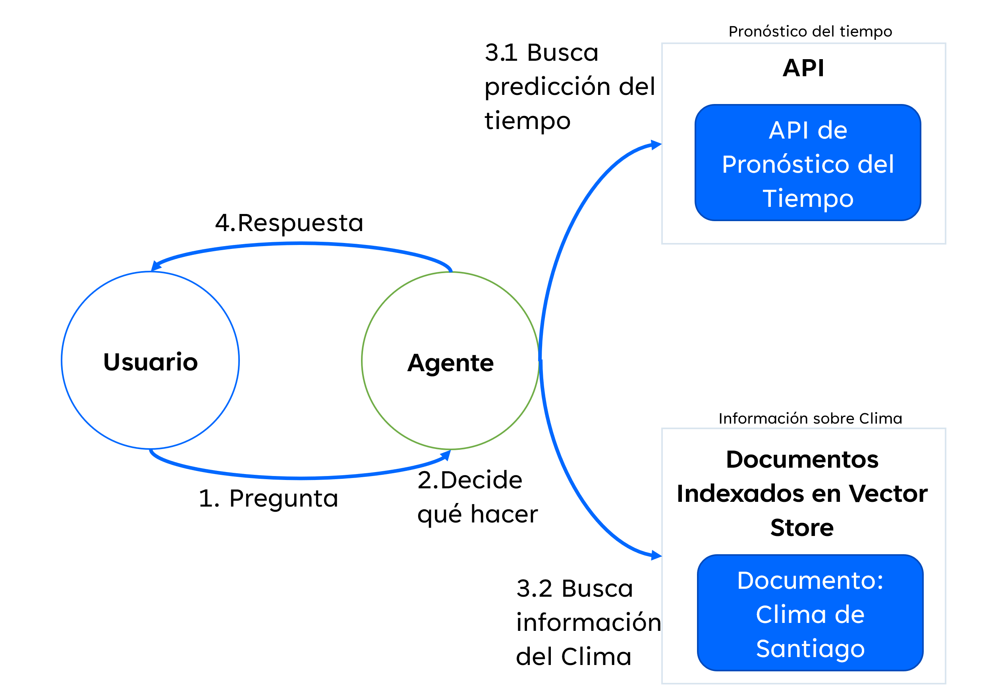
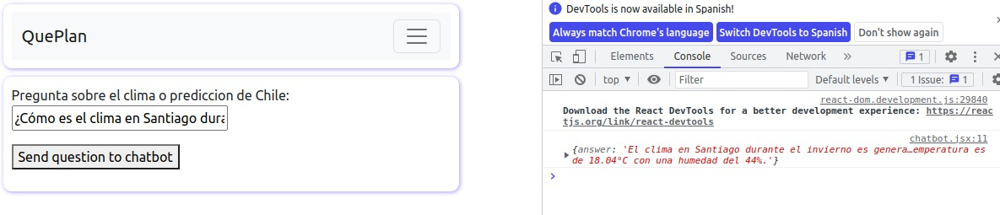

# Project
Create a robot with artificial intelligence capable of answering questions about the weather and the weather forecast in the city of Santiago de Chile.

# Deploy
## requirement
You need to have installed docker in your computer.
## steps
You first need to unzip the file. Then execute the following
```
docker compose up -d
```
after that, go to the following URL in your local computer
```
http://0.0.0.0:3000/chatbot
```
# Examples:

¿Cómo es el clima en Santiago durante el Invierno?

¿Qué temperatura hará el 3 de mayo en Santiago? 


# Observation
- In order to get acurate answer the temperature of the LLM was set to 0.